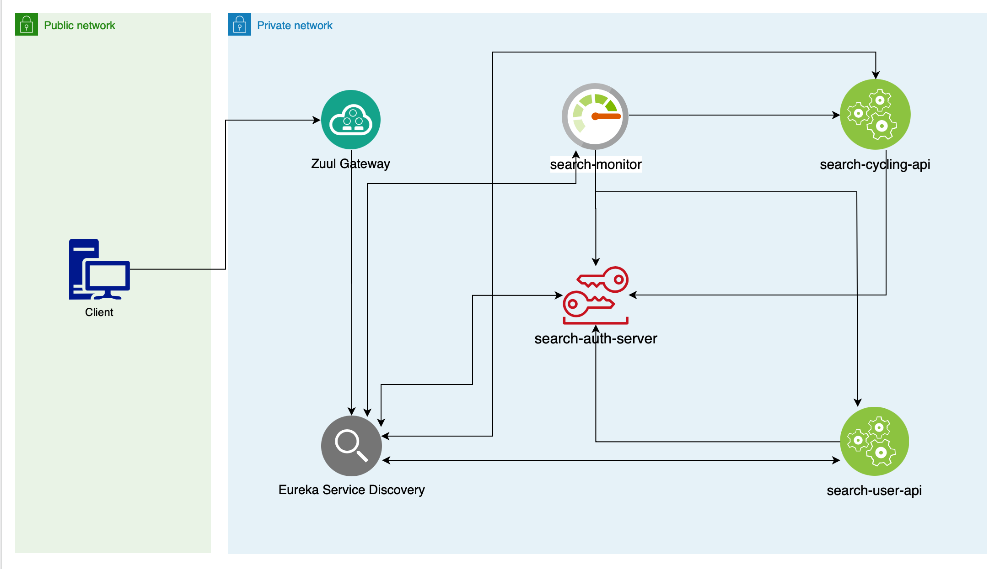
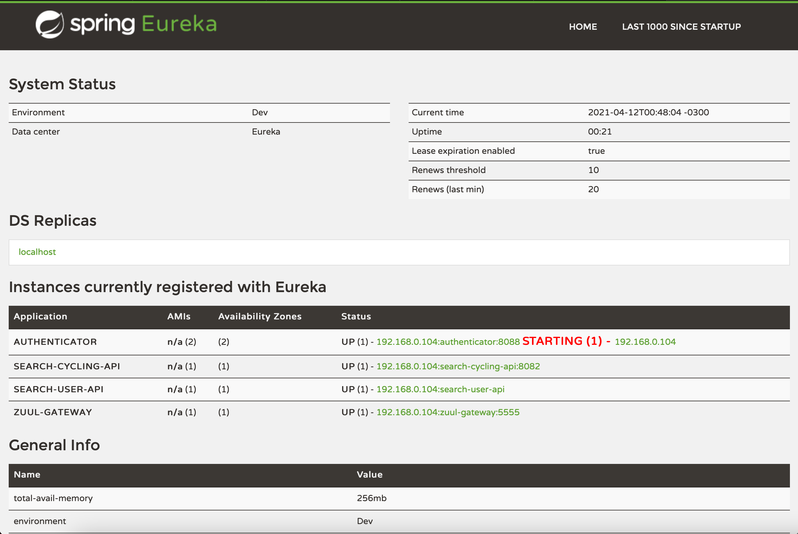
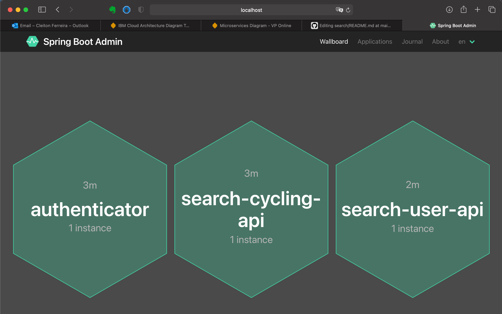
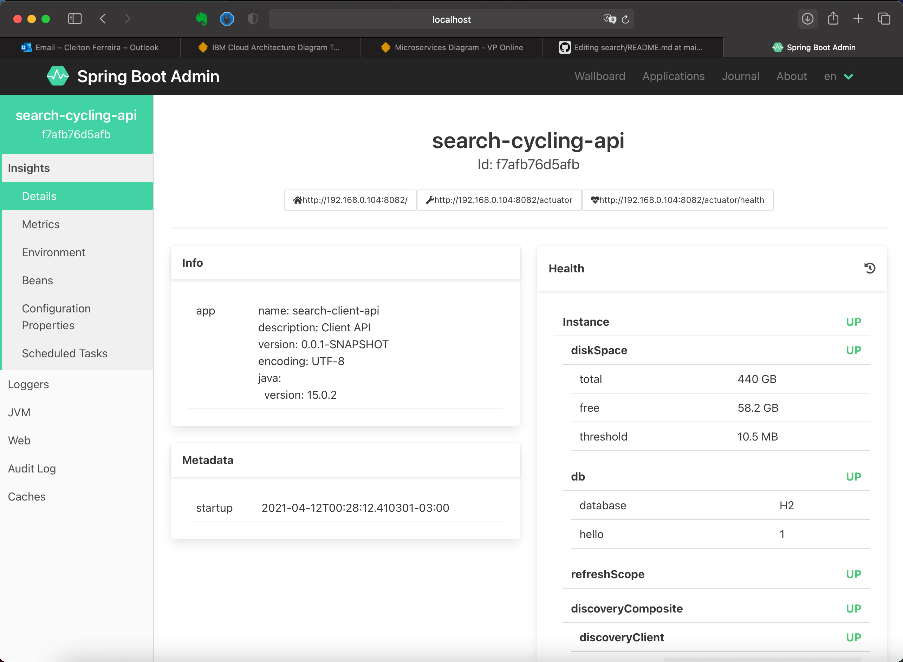

# search
Exemplo de arquitetura de microserviços utilizando Spring Cloud e Netflix OSS

## Construído com:

- [Spring Boot](https://spring.io/projects/spring-boot) - Responsável por criar o microserviço e realizar o seu processamento e persistência.
- [Maven](https://maven.apache.org/) - Ferramenta de build automático.
- [Junit](https://junit.org/junit5/) - Ferramenta utilizar para criação dos testes unitários.
- [Mockito](https://site.mockito.org/) - Ferramenta utilizada para realizar mock de objetos referente a limitação de ambiente(dev,teste e produção).
- [Docker](https://www.docker.com/) - Ferramenta utilizada para simular o ambiente de testes de forma íntegra.
- [Insominia](https://insomnia.rest/) - Ferramenta utilizada para realizar testes de chamadas via rest.
- [Swagger](https://swagger.io/) - Ferramenta utilizada para documentação da API construída neste projeto.
- [Jenkins](https://jenkins.io/) - Ferramenta responsável pela execução da automatização de testes e integração contínua.
- [Spring Netflix Eureka](https://spring.io/projects/spring-cloud-netflix/) - Service Discovery responsável por unificar o registros dos microserviços.
- [Spring Feign](https://spring.io/projects/spring-cloud-openfeign/) - Reponsável por executar o Load Balance através do Ribbon na chamada de intgração dos microserviços.
- [Spring Sleuth](https://spring.io/projects/spring-cloud-sleuth/) - Responsável por realizar o trace de log através de um identificador único(Trace ID). 
- [Zuul-Gateway](https://spring.io/projects/spring-cloud-sleuth/) - Responsável por se conectar com o eureka e expor via gateway os microserviços registrados.

## Arquitetura

- Montei o fluxograma abaixo para representar de maneira ilustrativa como foi aplicado cada tecnologia e como se relacionam.

## Microserviços

- http://localhost:8761/ - Eureka-Server - Service Discovery responsável por registar os microserviços
- http://localhost:5555/ - Zuul-Gateway -  Responsável por centralizar as chamadas externas
- http://localhost:8088/ - Authenticator - Responsável por realizar autenticação e autorização utilizando OAuth2
- http://localhost:8089/ - Spring Admin Monitor -  Monitora os microserviços
- http://localhost:8082/ - Cycling -    Responsável por disponbilizar o serviço de pesquisa de bicicletas
- http://localhost:8080/ - UserApi - Responsável por disponbilizar o serviço do usuário

## Configurações

| Spring Cloud components         | Resources  |
|---------------------------------|------------|
| Service Discovery               | [Eureka server](eureka-server) |
| API Gateway                     | [Zuul reverse proxy](zuul-gateway) and [Routing configuration] |
| Circuit Breaker                 | [Hystrix fallback method](search-user-api)  |

## Service Discovery

- Responsável por facilitar a comunicação entre 1 ou mais microserviços. Os microserviços se registram no Eureka e passam a ser chamado pelos demais através de sua alias.
Este ponto ajuda bastante quando temos vários microserviços na solução e bem como mais de uma instância.

- No exemplo abaixo é possível identificar os serviços registrados no Eureka. Com a arquitetura proposta é possível duplicar o serviços de (search-user-api e search-client-api, ...), caracterizando uma escalabilidade horizontal

## Monitoramento

- Atualmente a ferramenta mais utilizada por grande empresas para monitoramento de microserviços é o Splunk. Neste caso aqui fiz a utilização de um projeto chamado 
Spring Admin. A sua configuração é bem simples e sua interface é bastante amigável.

- Visualização de Dashboard apresentando o tempos de disponibilidade atual e número de instâncias.

- Detalhes de consumo e uso de memória

## Executar o projeto

- Deverá executar o projeto conforme as informações abaixo:

- (1) search-eureka-server 
- (2) search-zuul-gateway
- (3) search-auth-server
- (4) search-monitor
- (5) search-cycling-api
- (6) search-user-api

## Solução

- A arquitetura de microserviços tem sido bastante popular após o uso de sistemas através da cloud. Este tipo de arquitetura é caracterizado pela abordagem de 
desmembrar o software através de comoponentes mínimos e independentes. Essa abordagem valoriza a granularidade, leveza e capacidade de compartilhamento de processos
entre várias aplicações. Este ponto é indispensável para otimização do desenvolvimento de aplicações quando pensamos em um modelo nativo em nuvem.

- A solução a apresentada aqui não tem fins de utilização comercial e sim apresentação de técnicas disponíveis no mercado para monitoramento, escalabilidade e independência da solução como um todo.
